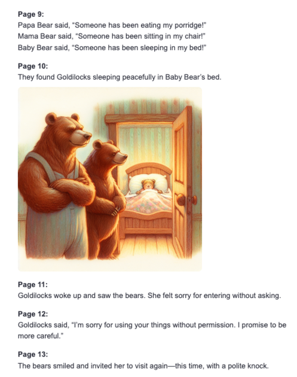
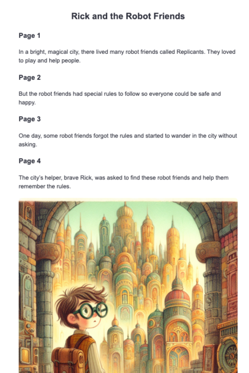
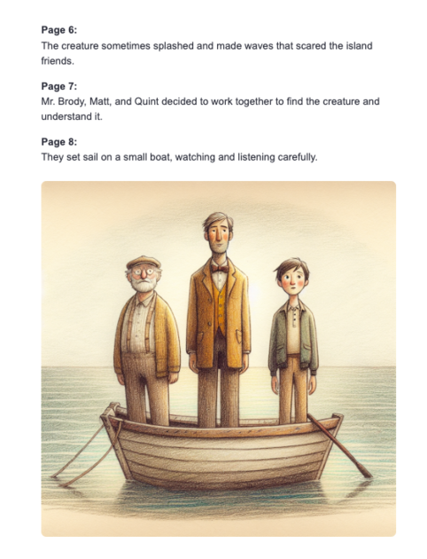

# Week 2: Story Transformation Agent

An AI-powered application that transforms adult stories into children's stories using OpenAI's GPT-4 and DALL-E.

## Features

- Multi-step story transformation process
- FastAPI backend API
- Streamlit frontend
- Image generation with DALL-E
- Comprehensive logging
- Error handling

### Example Transformations




## Architecture

The project consists of three main components:

1. **Agent** (`agent.py`): Core transformation logic using OpenAI's APIs
2. **API Server** (`main.py`): FastAPI server that exposes the agent functionality
3. **Frontend** (`app.py`): Streamlit interface for interacting with the agent

## Setup

1. Create and activate a virtual environment:
   ```bash
   python -m venv .venv
   source .venv/bin/activate  # On Windows: .venv\Scripts\activate
   ```

2. Install dependencies:
   ```bash
   pip install -r requirements.txt
   ```

3. Set up your OpenAI API key:
   - Create a `.env` file in the project root
   - Add your API key: `OPENAI_API_KEY=your-key-here`
   - Add `.env` to your `.gitignore`

## Running Locally

1. Start the FastAPI server:
   ```bash
   uvicorn main:app --port 8000
   ```

2. In a separate terminal, start the Streamlit frontend:
   ```bash
   streamlit run app.py
   ```

3. Open your browser to `http://localhost:8501`

## Deployment on Render.com

The application is deployed on render.com with the following configuration:

1. **Service Type**: Web Service
2. **Build Command**: `pip install -r requirements.txt`
3. **Start Command**: `uvicorn main:app --host 0.0.0.0 --port $PORT`
4. **Environment Variables**:
   - `OPENAI_API_KEY`: Your OpenAI API key
   - `PYTHON_VERSION`: 3.10.0

The service automatically deploys when changes are pushed to the main branch.

## API Endpoints

- `POST /chat`: Main endpoint for story transformation
  ```json
  {
    "story_title": "The Tell-Tale Heart",
    "story_text": ""
  }
  ```
- `GET /`: Health check endpoint

## Error Handling

The application includes comprehensive error handling for:
- API requests
- OpenAI API interactions
- Server errors
- Environment configuration

## Logging

Application logs are available:
- Locally: In the console during development
- On Render: Via the render.com dashboard logs

## Roadmap

Future development plans include:

### Story Management
- Story library for saving and sharing transformations
- User accounts and personal collections
- Public/private story settings
- Export options (PDF, ePub)

### Customization
- Age-specific adaptations (2-4, 5-7, 8-12 years)
- Topic sensitivity controls for parents
- Reading level adjustments
- Cultural adaptation options
- Customizable moral lessons focus

### Extended Formats
- Chapter book generation (e.g., Harry Potter in 500-word chapters)
- Series creation with consistent character development
- Interactive story elements
- Multiple ending options

### Enhanced Illustrations
- Character consistency across illustrations
- Style matching between images
- Custom art style selection
- Character sheets for maintaining visual continuity
- Sequential art for key scenes

### Technical Improvements
- Caching for faster regeneration
- Batch processing for longer works
- API for third-party integrations
- Mobile-optimized interface 